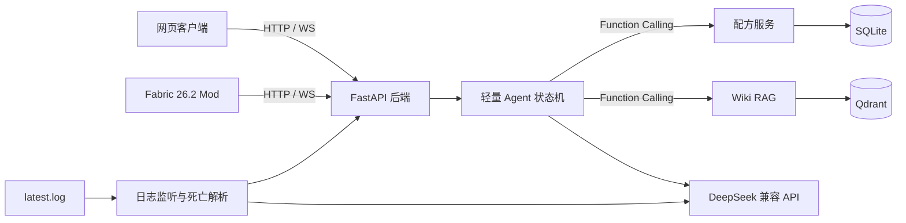

<div align="center">
    
    <h1>Minecraft Pilot Agent</h1>
    <p>为 MC 26.x 打造的 AI 游戏助手</p>
    <p>
        <a href="https://www.gnu.org/licenses/gpl-3.0.en.html">
            
        </a>
        <a href="https://github.com/brofea">
            
        </a>
    </p>
</div>

面向 Minecraft Java Edition 26.2 的本地游戏助手。将中文 Wiki RAG、官方配方数据和本地游戏日志接到一个轻量 Agent 后端，并提供网页界面与可选的 Fabric 客户端 Mod。

## 核心能力

1. **中文 Wiki RAG**：通过 `https://zh.minecraft.wiki/api.php` 采集白名单分类，使用 `BAAI/bge-small-zh-v1.5` 向量化并存入 Qdrant，查询结果保留页面 URL 与 revision ID。
2. **确定性配方树**：从 Mojang 官方版本清单下载 26.2 客户端 JAR，校验 SHA-1，提取配方、标签与语言资源，再由代码计算直接配方、N 层材料树和叶子材料汇总；LLM 不参与数量计算。
3. **游戏日志分析**：只读监听本地 `latest.log`，识别本地玩家和简中/英文死亡消息，每次有效死亡最多调用一次 DeepSeek，并通过 WebSocket 推送一条短建议。
4. **轻量 Agent**：支持自然语言、MCP 风格 Function Calling、12 轮短期记忆、工具白名单、调用轮次限制与 token 预算。
5. **开发者后台**：展示系统、游戏、配方、RAG、LLM 和脱敏配置状态；仅允许本机访问。

<div align="center">
    
</div>

## 架构



## 快速开始：克隆即运行

### 1. 前置条件

- macOS 优先；Linux 也可运行网页、RAG 和配方功能
- Docker Desktop 与 Docker Compose
- 可选：DeepSeek API Key。没有 Key 时，网页、健康检查和配方功能仍可用；自然语言对话与死亡建议不可用
- 若要监听游戏日志，本机需安装并运行 Minecraft Java Edition 26.2

### 2. 克隆并配置

```bash
git clone <repo-url> mc-pilot
cd mc-pilot
cp .env.example .env
```

编辑 `.env`：

```dotenv
# 可选，但自然语言 Agent 和死亡建议需要它
DEEPSEEK_API_KEY=你的_API_Key

# macOS Minecraft 目录。请替换成真实用户名；路径中可以包含空格
MC_PILOT_MINECRAFT_DIR=/Users/你的用户名/Library/Application Support/minecraft
```

不要把 `.env` 提交到 Git。项目不会在网页或日志中返回 API Key。

仓库中已包含预构建的配方数据库（`data/mc_pilot.db`），无需额外构建。

### 3. 启动

```bash
docker compose up -d --build
docker compose ps
```

首次启动时会自动检查 Qdrant 中是否已有 Wiki 索引。如果没有，会在后台构建（下载嵌入模型 + 向量化，可能需要数分钟）。构建完成后数据保留在 Docker 卷中，后续启动秒级就绪。

验证：

```bash
curl http://127.0.0.1:8000/health/live
curl http://127.0.0.1:8000/health/ready
```

预期结果：

- `live` 返回 `{"status":"alive","version":"0.1.0"}`；
- `ready` 中 SQLite 和 Qdrant 均为 `ready`；
- 浏览器可访问 <http://127.0.0.1:8000>；
- 开发者后台可访问 <http://127.0.0.1:8000/admin>；
- OpenAPI 文档可访问 <http://127.0.0.1:8000/docs>。

### 4. 停止服务

```bash
docker compose down
```

这不会删除数据卷。只有明确执行 `docker compose down -v` 才会删除本地项目数据。

## 更新数据

当 Minecraft 版本更新或 Wiki 内容变化后，可以重新构建数据。

### 更新配方数据

```bash
# Docker 模式
docker compose exec app python scripts/build_recipes.py

# 本地模式
.venv/bin/python scripts/build_recipes.py
```

配方构建通常较快（约 1–2 分钟）。可通过 `--version` 指定目标版本（默认 26.2）：

```bash
docker compose exec app python scripts/build_recipes.py --version 27.0
```

### 更新 Wiki 索引

```bash
# Docker 模式
docker compose exec app python scripts/build_wiki.py

# 本地模式
.venv/bin/python scripts/build_wiki.py
```

Wiki 构建会抓取九类页面并在 CPU 上生成数千条向量，首次运行可能需要数十分钟（后续增量运行更快，因为 API 响应有缓存）。看到连续的 Qdrant `points ... 200 OK` 属于正常进度，请等待终端出现 `Wiki index built` 并返回命令提示符。可在另一终端确认：

```bash
curl http://127.0.0.1:8000/admin/api/rag
```

构建完成后应显示 `"index_exists":true`。

### 验证更新

```bash
curl http://127.0.0.1:8000/admin/api/recipes
curl http://127.0.0.1:8000/admin/api/rag

curl -X POST http://127.0.0.1:8000/api/chat \
  -H 'Content-Type: application/json' \
  -d '{"message":"/pilot recipe minecraft:crafting_table"}'

curl -X POST http://127.0.0.1:8000/api/chat \
  -H 'Content-Type: application/json' \
  -d '{"message":"/pilot wiki 石头"}'
```

## 本地开发

本项目只使用 `pip`、`.venv` 和 Docker，不使用 conda。

### 1. Python 环境

```bash
python3.12 -m venv .venv
.venv/bin/python -m pip install --upgrade pip
.venv/bin/python -m pip install -e '.[dev]'
cp .env.example .env
```

如果系统命令名是 `python3`，先用 `python3 --version` 确认版本为 3.12。

### 2. 只启动 Qdrant

```bash
docker compose up -d qdrant
```

### 3. 构建数据并启动 FastAPI

```bash
.venv/bin/python scripts/build_recipes.py
.venv/bin/python scripts/build_wiki.py
.venv/bin/uvicorn mc_pilot.app:create_app --factory --host 127.0.0.1 --port 8000
```

本地模式与全 Docker 模式使用不同的 SQLite 存储位置。请选择一种模式完成"构建数据 → 启动应用"，不要在宿主机生成数据后期待 Docker volume 自动同步。

## 使用方式

网页输入框接受自然语言提问。Agent 自动选择 Function Calling：

| 输入 | 行为 | 前置条件 | 消耗 LLM |
|---|---|---|---|
| `你好` 或打招呼 | Agent 返回功能介绍 | LLM API KEY | 是 |
| `钻石剑需要什么材料` | Agent 调用 recipe_query | LLM API KEY | 是 |
| `凋零骷髅在哪生成` | Agent 调用 wiki_search | LLM API KEY | 是 |
| `查看状态` | Agent 调用 get_status | LLM API KEY | 是 |
| `/pilot wiki 末地传送门` | 直接检索 Wiki（不走 LLM） | 已构建 Wiki 索引 | 否 |
| `/pilot recipe minecraft:bow` | 直接查配方树（不走 LLM） | 已构建配方数据 | 否 |

配方物品建议使用完整资源 ID，例如 `minecraft:enchanting_table`。

### 死亡建议

Docker 模式从只读挂载的 `/minecraft/logs/latest.log` 读取新增内容；本地模式默认检查：

```text
~/Library/Application Support/minecraft/logs/latest.log
```

当日志存在、识别到本地玩家且 DeepSeek 已配置时，解析死亡消息并推送建议。

## 数据来源与确定性边界

### 配方

- 信任根：Mojang 官方版本清单与客户端 JAR SHA-1；
- 当前构建目标：Java Edition 26.2 `release`；
- 提取内容：配方 JSON、物品标签和必要语言资源；
- 计算方式：代码递归遍历，含深度、循环与节点上限。

### Wiki

- API：`https://zh.minecraft.wiki/api.php`；
- 默认白名单：方块、物品、生物、群系、游戏规则、附魔、状态效果、结构与命令；
- 排除基岩版、教育版、快照、开发版和版本记录等页面；
- 检索结果包含来源 URL。

## 开发者后台

<http://127.0.0.1:8000/admin> 展示：

- 系统版本与运行环境；
- 游戏连接、玩家、日志和死亡次数；
- 配方版本；
- RAG、LLM 与 Agent 配置状态；
- 经 `Settings.safe_summary()` 脱敏后的配置；
- 健康检查与日志重连操作。

后台仅允许 loopback Host。

## API 摘要

完整交互式文档见 <http://127.0.0.1:8000/docs>。

| 方法 | 路径 | 用途 |
|---|---|---|
| GET | `/health/live` | 进程存活 |
| GET | `/health/ready` | SQLite/Qdrant 就绪状态 |
| POST | `/api/chat` | Agent 与 `/pilot` 命令入口 |
| POST | `/api/chat/stream` | SSE 流式 Agent 响应 |
| GET | `/api/agent-status` | 模型是否配置 |
| GET | `/api/recipes/{item_id}` | 直接配方查询 |
| POST | `/api/recipes/tree` | 数量与深度可配置的配方树 |
| GET | `/api/game-state` | 当前游戏状态 |
| GET/POST/DELETE | `/api/conversations` | 对话管理 |
| WS | `/ws` | 状态心跳与死亡建议 |
| GET | `/admin/api/*` | 本机开发诊断接口 |

## Fabric Mod

要求：JDK 25、Minecraft Java Edition 26.2、本地 Pilot 后端运行在 `127.0.0.1:8000`。

构建：

```bash
cd fabric-mod
./gradlew clean build
```

产物：`fabric-mod/build/libs/pilot-mod-0.1.0.jar`

将 JAR 放入对应 Fabric 客户端的 `mods/` 目录。

## 质量检查

```bash
.venv/bin/ruff check .
.venv/bin/mypy src tests
.venv/bin/pytest -q
docker compose config --quiet

cd fabric-mod
./gradlew clean build
```

## 项目结构

```text
.
├── src/mc_pilot/
│   ├── agent/          # DeepSeek 客户端、状态机、记忆与工具契约
│   ├── api/            # HTTP 与 WebSocket 适配层
│   ├── game/           # 日志发现、尾随、死亡解析与建议
│   ├── rag/            # MediaWiki 采集、分块、嵌入、Qdrant 检索
│   ├── recipes/        # 官方数据下载、提取、SQLite 与配方树
│   ├── admin/          # 本机开发诊断 API
│   ├── templates/      # Jinja2 页面
│   └── static/         # 原生 JavaScript 与 CSS
├── data/               # 预构建配方数据库
├── scripts/            # 配方、Wiki 与 Docker 初始化脚本
├── tests/              # 离线确定性测试
├── fabric-mod/         # Fabric 26.2 客户端 Mod
├── docs/               # 课程要求与实验报告
├── compose.yaml
├── Dockerfile
└── pyproject.toml
```

## 环境变量

| 变量 | 默认值 | 说明 |
|---|---|---|
| `DEEPSEEK_API_KEY` | 空 | 自然语言 Agent 和死亡建议所需 |
| `DEEPSEEK_BASE_URL` | `https://api.deepseek.com` | OpenAI 兼容 API 根地址 |
| `DEEPSEEK_MODEL` | `deepseek-v4-flash` | 发送给兼容 API 的模型名，可覆盖 |
| `MC_PILOT_HOST` | `127.0.0.1` | 本地运行绑定地址；Compose 内覆盖为 `0.0.0.0` |
| `MC_PILOT_PORT` | `8000` | HTTP 端口 |
| `MC_PILOT_SQLITE_URL` | `sqlite:///data/mc_pilot.db` | SQLite URL |
| `MC_PILOT_QDRANT_URL` | `http://localhost:6333` | Qdrant URL；Compose 内覆盖为服务名 |
| `MC_PILOT_QDRANT_TIMEOUT_SECONDS` | `2` | 健康探针超时 |
| `MC_PILOT_GAME_LOG_PATH` | 空 | 本地运行时覆盖 `latest.log` 路径 |
| `MC_PILOT_MINECRAFT_DIR` | macOS 默认目录 | Compose 只读挂载源；不是 Pydantic 应用配置 |

## 故障排查

### `ready` 显示 Qdrant degraded

```bash
docker compose ps
docker compose logs qdrant
```

### 配方查询为空

确认数据构建发生在当前运行模式：

```bash
# Docker 模式
docker compose exec app python scripts/build_recipes.py

# 本地模式
.venv/bin/python scripts/build_recipes.py
```

### Wiki 提示知识库尚未构建

首次 `docker compose up` 时会自动构建。如需手动触发：

```bash
docker compose exec app python scripts/build_wiki.py
```

### Docker 无法读取 Minecraft 目录

确认 `.env` 中路径真实存在，并在 Docker Desktop 中允许访问该 macOS 目录。

### Agent 请求失败

```bash
docker compose exec app python scripts/test_connectivity.py
docker compose logs --tail=100 app
```

## 已知限制

- 仅覆盖 Java Edition 26.2 正式版，不承诺其他 26.x 版本；
- 会话记忆保存在当前后端进程内，服务重启后清空；
- Wiki 采用白名单分类，不等于抓取整个中文 Minecraft Wiki；
- 未提供真实 DeepSeek Key 时，自动化测试不会证明线上模型账户与额度可用；
- Fabric Mod 当前固定连接 `127.0.0.1:8000`。
